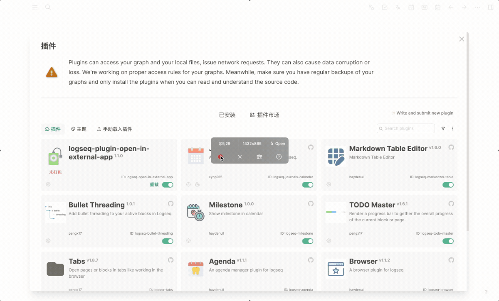

# logseq-plugin-open-in-external-app
> use external app to open logseq file

[](https://github.com/haydenull/logseq-plugin-open-in-external-app/releases)
[](https://github.com/haydenull/logseq-plugin-open-in-external-app/blob/main/LICENSE)

Inspired by [vscode plugin open-in-external-app](https://marketplace.visualstudio.com/items?itemName=YuTengjing.open-in-external-app)

English | [简体中文](./README-zh_CN.md)

## Demo


Demo use [vscode](https://code.visualstudio.com/) and [Excalidraw Schema Editor](https://marketplace.visualstudio.com/items?itemName=pomdtr.excalidraw-editor) plugin.

## Usage
1. Install plugin
2. Fill in configuration information
3. Restart Logseq to take effect

## Plugin Configuration
menus: Registered menus
  - menuName: Menu name
  - pathRegExp: Get file path from block content regexp
  - extensionName: Open file extension name
  - apps:
    - title: App name
    - openSchema: Call app schema, `{path}` will be replaced by file path

## Configuration Example
```json
{
  "menus": [
    {
      "menuName": "Excalidraw",
      "pathRegExp": "\\[\\[([\\d\\D]+)]]",
      "extensionName": "excalidraw",
      "apps": [
        {
          "title": "vscode",
          "openSchema": "vscode://file/{path}"
        }
      ]
    }
  ]
}
